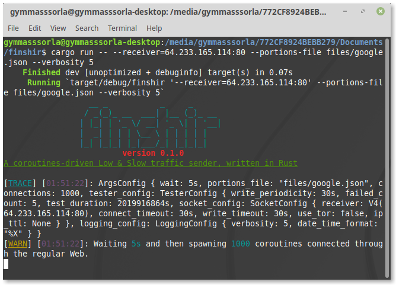

<div align="center">
  <h1>finshir</h1>
  
  <a href="https://gitter.im/Gymmasssorla/finshir">
    
  </a>
  <a href="https://travis-ci.com/Gymmasssorla/finshir">
    
  </a>
  <a href="https://github.com/Gymmasssorla/finshir/blob/master/LICENSE">
    
  </a>
  <a href="https://crates.io/crates/finshir">
    
  </a>
  <a href="https://semver.org">
    
  </a>
  
  <br>
  
  You are seeing a high-performant, coroutines-driven, and fully customisable implementation of [Low & Slow](https://www.cloudflare.com/learning/ddos/ddos-low-and-slow-attack/) load generator designed for real-world pentesting. Its complete undetectability is achieved by connecting through [Tor](https://en.wikipedia.org/wiki/Tor_%28anonymity_network%29).
  
  <h4>
    <a href="https://github.com/Gymmasssorla/finshir/pulse">Pulse</a> &middot;
    <a href="https://github.com/Gymmasssorla/finshir/stargazers">Stargazers</a> &middot;
    <a href="https://github.com/Gymmasssorla/finshir/releases">Releases</a> &middot;
    <a href="https://github.com/Gymmasssorla/finshir/blob/master/CONTRIBUTING.md">Contributing</a>
  </h4>
</div>

----------

## Contents
 - [Features](https://github.com/Gymmasssorla/finshir#features)
 - [Installation](https://github.com/Gymmasssorla/finshir#installation)
   - [Building from crates.io](https://github.com/Gymmasssorla/finshir#building-from-cratesio)
   - [Building from sources](https://github.com/Gymmasssorla/finshir#building-from-sources)
   - [Pre-compiled binaries](https://github.com/Gymmasssorla/finshir#pre-compiled-binaries)
 - [Options](https://github.com/Gymmasssorla/finshir#options)
 - [Overview](https://github.com/Gymmasssorla/finshir#overview)
   - [Minimal command](https://github.com/Gymmasssorla/finshir#minimal-command)
   - [Using the Tor network](https://github.com/Gymmasssorla/finshir#using-the-tor-network)
   - [Test intensity](https://github.com/Gymmasssorla/finshir#test-intensity)
   - [Connections count](https://github.com/Gymmasssorla/finshir#connections-count)
   - [Custom data portions](https://github.com/Gymmasssorla/finshir#custom-data-portions)
   - [Logging options](https://github.com/Gymmasssorla/finshir#logging-options)
 - [Gallery](https://github.com/Gymmasssorla/finshir#gallery)
   - [Initialisation](https://github.com/Gymmasssorla/finshir#initialisation)
   - [Errors](https://github.com/Gymmasssorla/finshir#errors)
   - [Being verbose](https://github.com/Gymmasssorla/finshir#being-verbose)
 - [Contributing](https://github.com/Gymmasssorla/finshir#contributing)
 - [Target platform](https://github.com/Gymmasssorla/finshir#target-platform)
 - [Legal disclaimer](https://github.com/Gymmasssorla/finshir#legal-disclaimer)
 - [Project links](https://github.com/Gymmasssorla/finshir#project-links)
 - [Contacts](https://github.com/Gymmasssorla/finshir#contacts)

----------

## Features
 - **Coroutines-driven.** Finshir uses [coroutines](https://en.wikipedia.org/wiki/Coroutine) (also called lightweight threads) instead of ordinary threads, which lets you open many more connections with fewer system resources.

 - **Generic.** Unlike other Low & Slow utilities, Finshir lets you transmit arbitrary data sets over the [TCP](https://en.m.wikipedia.org/wiki/Transmission_Control_Protocol) protocol. It may be partial HTTP headers, empty spaces, and so on.
 
 - **Written in Rust.** How you can see, all the logic is written completely in [Rust](https://www.rust-lang.org/), which means that it leverages bare-metal performance and high-level safety (no SIGSEGV, SIGILL, and other "funny" stuff).

----------

## Installation
Currently, this project requires unstable standard library features, so this is why you must switch to the nightly channel to avoid compilation errors:

```
$ rustup override set nightly-2019-04-25
```

### Building from crates.io
```bash
$ cargo install finshir
```

### Building from sources
```bash
$ git clone https://github.com/Gymmasssorla/finshir.git
$ cd finshir
$ cargo build --release
```

### Pre-compiled binaries
The easiest way to run Finshir on your system is to download the pre-compiled binaries from the [existing releases](https://github.com/Gymmasssorla/finshir/releases), which doesn't require any external software (unlike the two previous approaches).

----------

## Options
```
finshir 0.1.0
Temirkhan Myrzamadi <gymmasssorla@gmail.com>
A coroutines-driven Low & Slow traffic sender, written in Rust

USAGE:
    finshir [FLAGS] [OPTIONS] --receiver <SOCKET-ADDRESS>

FLAGS:
    -h, --help       Prints help information
        --use-tor    Torify all sockets by connecting to a SOCKS5 proxy running
                     on 127.0.0.1:9050
    -V, --version    Prints version information

OPTIONS:
        --connect-timeout <TIME-SPAN>
            If a timeout is reached and a socket wasn't connected, the program
            will retry the operation later.
            
            Note that this option currently doesn't work on sockets which are
            trying to connect through Tor. [default: 30secs]
    -c, --connections <POSITIVE-INTEGER>
            A number of connections the program will handle simultaneously. This
            option also equals to a number of coroutines [default: 1000]
        --date-time-format <STRING>
            A format for displaying local date and time in log messages. Type
            `man strftime` to see the format specification [default: %X]
        --failed-count <POSITIVE-INTEGER>
            A number of failed data transmissions used to reconnect a socket to
            a remote web server [default: 5]
        --ip-ttl <UNSIGNED-INTEGER>
            Specifies the IP_TTL value for all future sockets. Usually this
            value equals a number of routers that a packet can go through
    -f, --portions-file <LOCATION>
            A file consisting of a custom JSON array of data portions, specified
            as strings
    -r, --receiver <SOCKET-ADDRESS>
            A receiver of generator traffic, specified as an IP address and a
            port number, separated by a colon
    -d, --test-duration <TIME-SPAN>
            A whole test duration, after which all spawned coroutines will stop
            their work [default: 64years 64hours 64secs]
    -v, --verbosity <LEVEL>
            Enable one of the possible verbosity levels. The zero level doesn't
            print anything, and the last level prints everything [default: 3]
            [possible values: 0, 1, 2, 3, 4, 5]
    -w, --wait <TIME-SPAN>
            A waiting time span before test execution used to prevent a launch
            of an erroneous (unwanted) test [default: 5secs]
        --write-periodicity <TIME-SPAN>
            A time interval between writing data portions. This option can be
            used to modify test intensity [default: 30secs]
        --write-timeout <TIME-SPAN>
            If a timeout is reached and a data portion wasn't sent, the program
            will retry the operation later [default: 30secs]

By default, Finshir generates 100 empty spaces as data portions. If you want to
override this behaviour, consider using the `--portions-file` option.

For more information see <https://github.com/Gymmasssorla/finshir>.
```

----------

## Overview

### Minimal command
The following command spawns 1000 coroutines, each trying to establish a new TCP connection. When connections are established, it sends empty spaces every 30 seconds, thereby order a server to wait as long as it can:

```bash
# Specify one of the Google's IP addresses as a target web server
$ finshir --receiver=64.233.165.113:80
```

### Using the Tor network
You can do this by specifying the `--use-tor` flag. It connects to your local SOCKS5 proxy running on 9050 port, which is typically used by Tor proxies. Also consider modifying the default configuration file located in `/etc/tor/torrc`.

```bash
# Connect to the Google's address through your local Tor proxy
$ finshir --receiver=64.233.165.113:80 --use-tor
```

### Test intensity
Low & Slow techniques assume to be VERY SLOW, which means that you typically send a couple of bytes every N seconds. For instance, Finshir uses the 30 seconds interval by default, but it's modifiable as well:

```bash
# Test the Google's server sending data portions every one minute
$ finshir --receiver=64.233.165.113:80 --write-periodicity=1min
```

### Connections count
The default number of parallel connections is 1000. However, you can modify this limit using the `--connections` option, but be sure that you system is able to handle such amount of file descriptors:

```bash
# Modify the default limit of file descriptors to 17015
$ sudo ulimit -n 17015

# Test the target server using 17000 parallel TCP connections
$ finshir --receiver=64.233.165.113:80 --connections=17000
```

### Custom data portions
By default, Finshir generates 100 empty spaces as data portions to send. You can override this behaviour by specifying your custom messages as a file, consisting of a single JSON array. This example is focused on Google:

```bash
# Send partial HTTP headers to Google using `--portions-file`
$ finshir --receiver=64.233.165.113:80 --portions-file files/google.json
```

### Logging options
Consider specifying a custom verbosity level from 0 to 5 (inclusively), which is done by the `--verbosity` option. There is also the `--date-time-format` option which tells Finshir to use your custom date-time format.

```bash
# Use a custom date-time format and the last verbosity level
$ finshir --receiver=64.233.165.113:80 --date-time-format="%F" --verbosity=5
```

----------

## Gallery

<div align="center">
  <h3>Initialisation</h3>
  
  
  <h3>Errors</h3>
  
  
  <h3>Being verbose</h3>
  
</div>

----------

## Contributing
You are always welcome for any contribution to this project! But before you start, you should read [the appropriate document](https://github.com/Gymmasssorla/finshir/blob/master/CONTRIBUTING.md) to know about the preferred development process and the basic communication rules.

----------

## Target platform
Like most of pentesting utilities, this project is developed, tested, and maintained for only Linux-based systems. If you are a Windows user, you probably need a [virtual machine](https://en.wikipedia.org/wiki/Virtual_machine) or another computer with GNU/Linux.

----------

## Legal disclaimer
Finshir was developed as a means of testing stress resistance of web servers, and not for hacking, that is, the author of the project **IS NOT RESPONSIBLE** for any damage caused by your use of his program.

----------

## Project links
 - https://www.reddit.com/r/rust/comments/bm6ttn/finshir_a_coroutinesdriven_low_slow_ddos_attack/
 - https://www.producthunt.com/posts/finshir

----------

## Contacts
[Temirkhan Myrzamadi](https://github.com/Gymmasssorla) <[gymmasssorla@gmail.com](mailto:gymmasssorla@gmail.com)> (the author)
