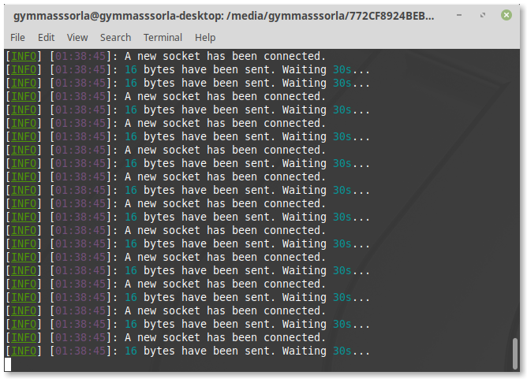
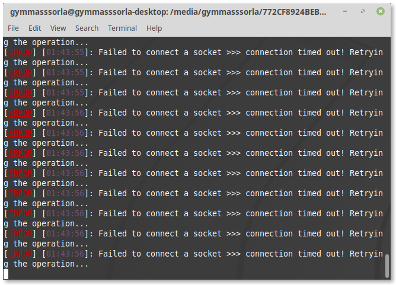

<div align="center">
  <h1>finshir</h1>
  
  <a href="https://gitter.im/Gymmasssorla/finshir">
    
  </a>
  <a href="https://travis-ci.com/Gymmasssorla/finshir">
    
  </a>
  <a href="https://github.com/Gymmasssorla/finshir/blob/master/LICENSE">
    
  </a>
  <a href="https://crates.io/crates/finshir">
    
  </a>
  <a href="https://semver.org">
    
  </a>
  
  <br>
  
  You are seeing a high-performant, coroutines-driven, and fully customisable implementation of [Low & Slow](https://www.cloudflare.com/learning/ddos/ddos-low-and-slow-attack/) load generator designed for real-world pentesting. Its complete undetectability is achieved by connecting through [Tor](https://en.wikipedia.org/wiki/Tor_%28anonymity_network%29).
  
  <h4>
    <a href="https://github.com/Gymmasssorla/finshir/pulse">Pulse</a> &middot;
    <a href="https://github.com/Gymmasssorla/finshir/stargazers">Stargazers</a> &middot;
    <a href="https://github.com/Gymmasssorla/finshir/releases">Releases</a> &middot;
    <a href="https://github.com/Gymmasssorla/finshir/blob/master/CONTRIBUTING.md">Contributing</a>
  </h4>
</div>

----------

## Contents

 - [Installation](https://github.com/Gymmasssorla/finshir#installation)
   - [Building from crates.io](https://github.com/Gymmasssorla/finshir#building-from-cratesio)
   - [Building from sources](https://github.com/Gymmasssorla/finshir#building-from-sources)
   - [Pre-compiled binaries](https://github.com/Gymmasssorla/finshir#pre-compiled-binaries)
 - [Getting started](https://github.com/Gymmasssorla/finshir#getting-started)
 - [Options](https://github.com/Gymmasssorla/finshir#options)
 - [Gallery](https://github.com/Gymmasssorla/finshir#gallery)
   - [Initialisation](https://github.com/Gymmasssorla/finshir#initialisation)
   - [Errors](https://github.com/Gymmasssorla/finshir#errors)
 - [Contributing](https://github.com/Gymmasssorla/finshir#contributing)
 - [Legal disclaimer](https://github.com/Gymmasssorla/finshir#legal-disclaimer)
 - [Contacts](https://github.com/Gymmasssorla/finshir#contacts)

----------

## Installation

### Building from crates.io
```bash
$ cargo install finshir
```

### Building from sources
```bash
$ git clone https://github.com/Gymmasssorla/finshir.git
$ cd finshir
$ cargo build --release
```

### Pre-compiled binaries
```bash
$ wget https://github.com/Gymmasssorla/finshir/releases/download/<VERSION>/finshir-x86_64-linux
$ chmod a+x finshir-x86_64-linux
$ ./finshir-x86_64-linux
```

----------

## Getting started
 1. Finshir operates a JSON array of data portions to send. Simply copy [this](https://github.com/Gymmasssorla/finshir/blob/master/files/google.json) into `<CURRENT-DIRECTORY>/finshir.json` so the program would understand which file to use.

 2. Next, execute `finshir --receiver=64.233.165.113:80` (Google's IP). This will perform an endless loop sending the next partial HTTP header each iteration, thereby order the server to wait as long as it can.

----------

## Options
```
finshir 0.1.0
Temirkhan Myrzamadi <gymmasssorla@gmail.com>
A coroutines-driven Low & Slow traffic sender, written in Rust

USAGE:
    finshir [FLAGS] [OPTIONS] --receiver <SOCKET-ADDRESS>

FLAGS:
    -h, --help       Prints help information
        --use-tor    Torify all sockets by connecting to a SOCKS5 proxy running
                     on 127.0.0.1:9050
    -V, --version    Prints version information

OPTIONS:
        --connect-timeout <TIME-SPAN>
            If a timeout is reached and a socket wasn't connected, the program
            will retry the operation later.
            
            Note that this option currently doesn't work on sockets which are
            trying to connect through Tor. [default: 30secs]
    -c, --connections <POSITIVE-INTEGER>
            A number of connections the program will handle simultaneously. This
            option also equals to a number of coroutines.
            
            Before using this option consider modifying a default limit of
            opened file descriptors using `sudo ulimit -n <COUNT>`. [default:
            1000]
        --date-time-format <STRING>
            A format for displaying local date and time in log messages. Type
            `man strftime` to see the format specification.
            
            Specifying a different format with days of weeks might be helpful
            when you want to test a server more than one day. [default: %X]
        --failed-count <POSITIVE-INTEGER>
            A number of failed data transmissions used to reconnect a socket to
            a remote web server [default: 5]
        --ip-ttl <UNSIGNED-INTEGER>
            Specifies the IP_TTL value for all future sockets. Usually this
            value equals a number of routers that a packet can go through
    -f, --portions-file <LOCATION>
            A location to a file consisting of a single JSON array of data
            portions, specified as strings.
            
            If an amount of data portions is reached on a certain connection, a
            connection will be reopened. [default: finshir.json]
    -r, --receiver <SOCKET-ADDRESS>
            A receiver of generator traffic, specified as an IP address and a
            port number, separated by a colon
    -d, --test-duration <TIME-SPAN>
            A whole test duration, after which all spawned coroutines will stop
            their work [default: 64years 64hours 64secs]
    -v, --verbosity <LEVEL>
            Enable one of the possible verbosity levels. The zero level doesn't
            print anything, and the last level prints everything [default: 3]
            [possible values: 0, 1, 2, 3, 4, 5]
    -w, --wait <TIME-SPAN>
            A waiting time span before test execution used to prevent a launch
            of an erroneous (unwanted) test [default: 5secs]
        --write-periodicity <TIME-SPAN>
            A time interval between writing data portions. This option can be
            used to modify test intensity [default: 30secs]
        --write-timeout <TIME-SPAN>
            If a timeout is reached and a data portion wasn't sent, the program
            will retry the operation later [default: 30secs]

For more information see <https://github.com/Gymmasssorla/finshir>.
```

----------

## Gallery

<div align="center">
  <h3>Initialisation</h3>
  
  
  <h3>Errors</h3>
  
</div>

----------

## Contributing
You are always welcome for any contribution to this project! But before you start, you should read [the appropriate document](https://github.com/Gymmasssorla/finshir/blob/master/CONTRIBUTING.md) to know about the preferred development process and the basic communication rules.

----------

## Legal disclaimer
Finshir was developed as a means of testing stress resistance of web servers, and not for hacking, that is, the author of the project **IS NOT RESPONSIBLE** for any damage caused by your use of his program.

----------

## Contacts
[Temirkhan Myrzamadi](https://github.com/Gymmasssorla) <[gymmasssorla@gmail.com](mailto:gymmasssorla@gmail.com)> (the author)
