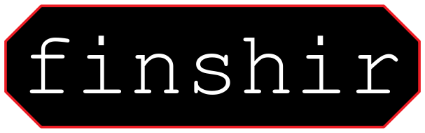

  <h1>finshir</h1>
  
  
  
  
  
  
  
   
  
  You are seeing a high-performant, coroutines-driven, and fully customisable implementation of [Low & Slow](https://www.cloudflare.com/learning/ddos/ddos-low-and-slow-attack/) load generator designed for real-world pentesting. Its complete undetectability is achieved by connecting through [Tor](https://en.wikipedia.org/wiki/Tor_%28anonymity_network%29).
  
  <h4>
    <a href="https://github.com/Gymmasssorla/finshir/pulse">Pulse</a> &middot;
    <a href="https://github.com/Gymmasssorla/finshir/stargazers">Stargazers</a> &middot;
    <a href="https://github.com/Gymmasssorla/finshir/releases">Releases</a> &middot;
    <a href="https://github.com/Gymmasssorla/finshir/blob/master/CONTRIBUTING.md">Contributing</a>
  </h4>

